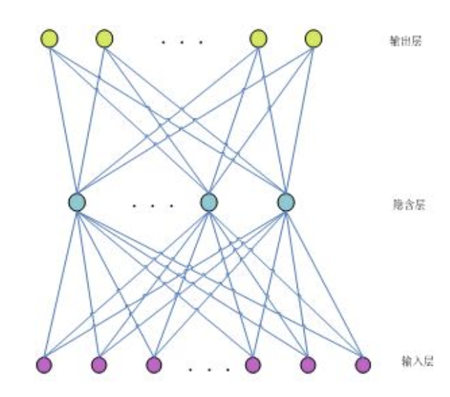
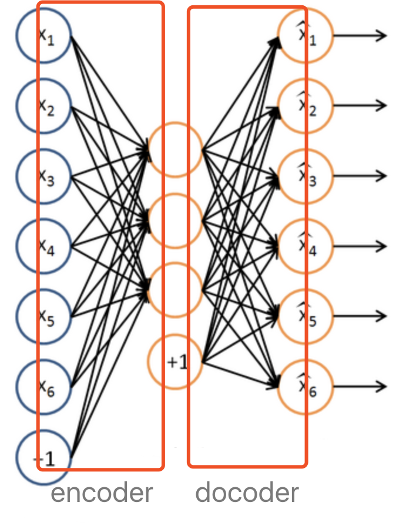
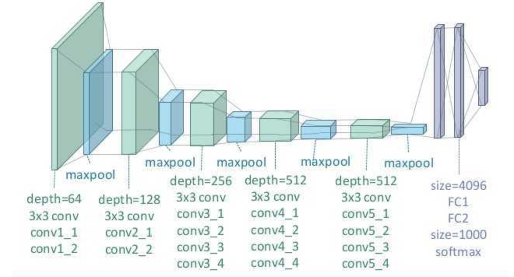
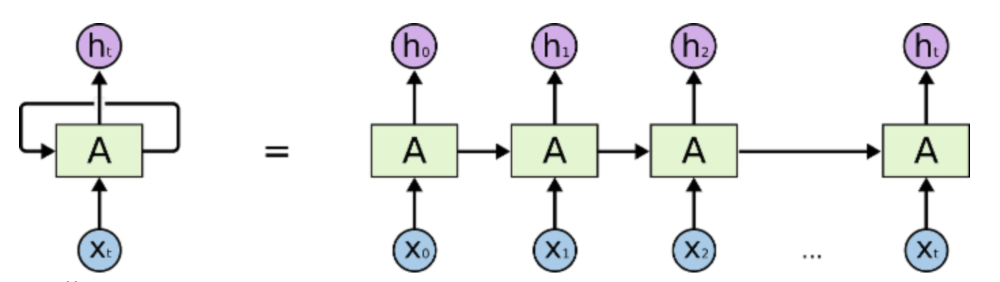
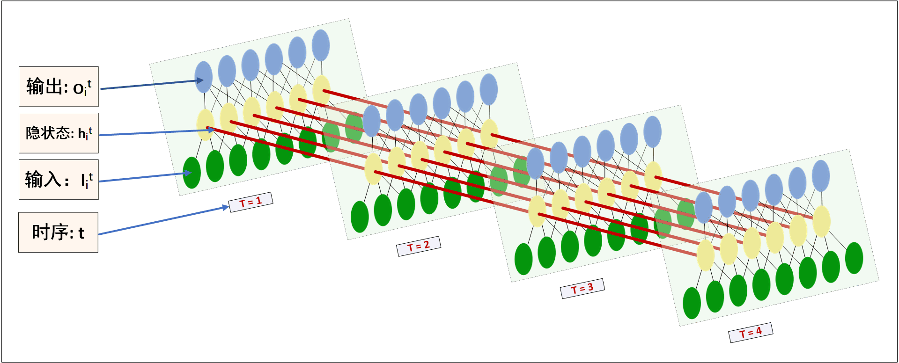
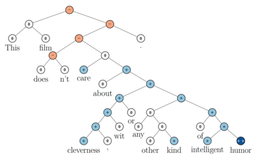
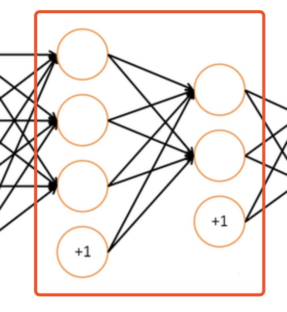

# 学习笔记：各大神经网络框架下实现几个基础结构神经网络

### see codes here [github: basic_NNs_in_frameworks](https://github.com/scofield7419/basic_NNs_in_frameworks)
---
###配套代码的数据集比较大，单独传到了百度云：[data at BaiduCloud](https://pan.baidu.com/s/1bpWH2OZ)
---

###  〇、Pre  

###  一、框架&网络分类比较  
&nbsp;&nbsp;&nbsp;&nbsp;1.1 主流框架分类  
&nbsp;&nbsp;&nbsp;&nbsp;1.2 网络分类比较
###  二、TensorFlow  
&nbsp;&nbsp;&nbsp;&nbsp;2.1 TensorFlow简介  
&nbsp;&nbsp;&nbsp;&nbsp;2.2 MLP  
&nbsp;&nbsp;&nbsp;&nbsp;2.3 AE  
&nbsp;&nbsp;&nbsp;&nbsp;2.4 CNNs  
&nbsp;&nbsp;&nbsp;&nbsp;2.5 RecurrentNNs  
&nbsp;&nbsp;&nbsp;&nbsp;&nbsp;&nbsp;&nbsp;&nbsp;2.5.1 seq2seq  
&nbsp;&nbsp;&nbsp;&nbsp;&nbsp;&nbsp;&nbsp;&nbsp;2.5.2 attention mechanism  
&nbsp;&nbsp;&nbsp;&nbsp;2.6 RecursiveNNs  

###  三、Pytorch  
&nbsp;&nbsp;&nbsp;&nbsp;3.1 Pytorch简介  
&nbsp;&nbsp;&nbsp;&nbsp;3.2 MLP  
&nbsp;&nbsp;&nbsp;&nbsp;3.3 AE  
&nbsp;&nbsp;&nbsp;&nbsp;3.4 CNNs  
&nbsp;&nbsp;&nbsp;&nbsp;3.5 RecurrentNNs  
&nbsp;&nbsp;&nbsp;&nbsp;3.6 GANs  
&nbsp;&nbsp;&nbsp;&nbsp;3.7 Reinforcement Learning  

###  四、Theano    
&nbsp;&nbsp;&nbsp;&nbsp;4.1 Theano简介  
&nbsp;&nbsp;&nbsp;&nbsp;4.2 MLP  
&nbsp;&nbsp;&nbsp;&nbsp;4.3 AE  
&nbsp;&nbsp;&nbsp;&nbsp;4.4 CNNs  
&nbsp;&nbsp;&nbsp;&nbsp;4.5 RecurrentNNs  

###  五、Keras  
&nbsp;&nbsp;&nbsp;&nbsp;5.1 Keras简介  
&nbsp;&nbsp;&nbsp;&nbsp;5.2 MLP  
&nbsp;&nbsp;&nbsp;&nbsp;5.3 AE  
&nbsp;&nbsp;&nbsp;&nbsp;5.4 CNNs  
&nbsp;&nbsp;&nbsp;&nbsp;5.5 RecurrentNNs  

###  六、总结  

###  Referrences

--

#  〇、Pre 
这是一篇个人笔记还有配套的代码，主要记录了实现在Python下的框架的几种基础网络的笔记。

一直都有一个想法，就是在常见流行的各大框架下实现几种基本的NN结构。其实这有点像打基础。因为在搞论文的过程中是需要经常复现一些结构，实现些new idea，那肯定不会是挑食受限于某一种框架，得都试试才行。所以得先在各大常用框架下练手熟悉基本网络结构类型。就好像学语言，别挑来挑去争来争去，哪个语言好哪个差，干脆都学了，快速实现各种语言才是正解，就像boss总怼我的那句话“我们计算机学院的动作一定要快”……

但时间总是太紧任务和计划又总太多，一直拖着，最后去年底几个月样子挤了时间，陆陆续续，在4个框架下把基本网络结构都实现了一下，部分代码从GitHub上借鉴而来。  

主要通过代码实践学习熟悉一下几部分内容：  

* 各框架下API的使用特点
* 理解tensor操作是怎么形成network的
* 各种网络的实现特点，尤其是CNNs、RecursiveNNs、RecurrentNNs
* 对图像数据以及文本数据的预处理
* 如何调参选参，如何确定loss function，
* more ……

具体选择分类任务还是回归任务，或者是CV还是NLP任务，看具体框架代码（以分类为主）。

代码范围说明：框架只选择python语言，网络结构只选择基础款。

* selected NN frameworks：`Pytorch`、`Theano`、`TensorFlow`、`keras`  
* selected NN hierarchy：`MLP`、`AutoEncoder`、`CNNs`、`RecurrentNNs`、`RecursiveNNs`  

#  一、框架&网络分类

###  1.1 主流框架分类  
根据编程模式分类，框架可分为：`命令式`、`符号式（声明式）`两种。

* 命令式编程，程序中可能会存在 for或 if 形式的控制流，即循环迭代的次数和 if 分支的执行都取决于入参，不同的输入会使得程序的执行不同。e.g., pytorch.
* 而符号式（声明式）将返回给使用者一个预构建好的计算图。对于计算图框架来说，这就对应于动态图，即图的结构（不只是结果）会随着输入的变化而发生变化。e.g., tensorflow, theano.

还可以将框架分为`基层框架`、`集成框架`两种。

* 基层框架
	* caffee: c++
	* torch: lua
		* Pytorch: python  
	* MXNet: c++/python
	* Theano: python
	* TensorFlow: python
	* CNTK: c++
	* deeplearning4j: java
	* ……
* 集成框架
	* keras
	* TensorLayer
	* TFLayer

###  1.2 深度网络拓扑分类比较  
关于所有的神经网络结构的调研我写过一篇笔记综述，特别完整，是将整个神经网络的所有的模型都综合调研一番，并合理分了类。但这里只挑选在深度学习下的几种常用结构做简单的介绍。 
  
####  1. multiple layer perceptron(**MLP**)  

一个perceptron(感知器)能实现线性分类，算是一种最简单的分类器。MLP(多层神经网络)，将层感知器按照一定的结构和系数进行组合，实现复杂空间的分割，解决非线性问题，如异或等逻辑问题。

再直白点，就是大家口里说的多层神经网络，purely plain neural network。以后别人说普通的神经网络，或者ANN，就是指MLP。
  

_MLP的能力，不是因为矩阵的线性变换嵌套，而是在于矩阵线性变换后的非线性映射的多级嵌套。_
MLP性能是后面其它款网络的benchmark，基础款，MLP实现了神经网络普遍具有的强大的非线性拟合能力。
具体有多简单，去各个框架下看看代码吧。

####  2. AutoEncoder(**AE**)  

在MLP的基础上，有人提出了AutoEncoder(自编码网络)的概念。如图所示，encoder层实现压缩变换，decoder层实现解压变换。
  
并且，encoder与decoder的结构（层数和节点数量）是镜像对称的，具体理解可参考代码，codes talk。

自编码网络的作用是，将输入样本压缩，再在输出端重建样本。有啥用呢？其实也就是将输入进来的数据通过训练得到压缩，去相关性化，具体理解可参考代码，codes talk。

####  3. Convolutional Neural Networks(**CNNs**)  
卷积神经网络（Convolutional Neural Network，CNN)，额具体就不必介绍了。

  

CNNs我也写过一个理解笔记，从CV和NLP两个方面建模数据去整体理解其作用。当然，知乎上有的回答还解释的蛮好的，但貌似都缺乏对一些关键细节的解释，所以建议多看，看个并集再总结出自己的理解。

一句话，CNNS系列在分类任务上(both CV & NLP),都有不错的效果。因为CNN的locality具有捕获n-gram的特征。

####  4. Recurrent Neural Networks(**RecurrentNNs**)  
循环神经网络(Recurrent Neural Networks)，也不用多介绍。唯一要强调的是大家口中的RNN，一般指Recurrent one,就是循环神经网络，不过我比较在乎你到底是在说RecurrentNNs还是RecursiveNNs。
嗯，一般看的最多的图是这个：

  

但是这个图对初学者不太友好，我感觉所有的关于描述RecurrentNNs的图都画得不好，不够明确，里面的细节丢失了。事实上里面一个"A"表示了一层的数据。我非常清楚，这是很多人不能理解RecurrentNNs的根本原因，他们就是无法搞清楚里面的拓扑结构，跟MLP联系不上。  

我觉得RecurrentNNs的图这样画，概念会更清晰些，一目了然。自己画的（为了简约，只画了4个time-steps ）……

  

####  5. Recursive Neural Networks(**RecursiveNNs**) 

递归神经网络（recursive NN），感觉有不少的人都根本不晓得Recursive neural network的存在……

好吧最气的是，有的论文还RNNs，也不指明……这也是不够负责任。

具体呢，递归神经网络算是循环神经网络的更泛化的结构。
> **recurrent**: 时间维度的展开，代表信息在时间维度从前往后的的传递和积累，可以类比markov假设，后面的信息的概率建立在前面信息的基础上，在神经网络结构上表现为后面的神经网络的隐藏层的输入是前面的神经网络的隐藏层的输出；  
> **recursive**: 空间维度的展开，是一个树结构，比如nlp里某句话，用recurrent neural network来建模的话就是假设句子后面的词的信息和前面的词有关，而用recurxive neural network来建模的话，就是假设句子是一个树状结构，由几个部分(主语，谓语，宾语）组成，而每个部分又可以在分成几个小部分，即某一部分的信息由它的子树的信息组合而来，整句话的信息由组成这句话的几个部分组合而来。

  

用RecursiveNNs，在NLP里面，做任务的也不是很多，也就是斯坦福那个实验室socher他们几个在做，最近两年也做得不多了。因为虽然利用了syntactic 信息，但效果有时还不如RecurrentNNs。

#  二、TensorFlow
###  2.1 TF简介  
感觉介绍TF就都是废话……

TF 就是典型的符号式框架，直白理解，就是，等你构建好了整个`计算图`后，才能才是让他跑起来，迭代变量。

**2.1.1 api学习:**  
`一、tf.truncated_normal: `  
tf.truncated_normal(shape, mean=0.0, stddev=1.0, dtype=tf.float32, seed=None, name=None)  
shape: 一维的张量，也是输出的张量。  
mean: 正态分布的均值。  
stddev: 正态分布的标准差。  
dtype: 输出的类型。  
seed: 一个整数，当设置之后，每次生成的随机数都一样。  
name: 操作的名字。  

从截断的正态分布中输出随机值。生成的值服从具有指定平均值和标准偏差的正态分布，如果生成的值大于平均值2个标准偏差的值则丢弃重新选择。  

在正态分布的曲线中，横轴区间（μ-σ，μ+σ）内的面积为68.268949%。  
横轴区间（μ-2σ，μ+2σ）内的面积为95.449974%。  
横轴区间（μ-3σ，μ+3σ）内的面积为99.730020%。  
X落在（μ-3σ，μ+3σ）以外的概率小于千分之三，在实际问题中常认为相应的事件是不会发生的，基本上可以把区间（μ-3σ，μ+3σ）看作是随机变量X实际可能的取值区间，这称之为正态分布的“3σ”原则。  
在tf.truncated_normal中如果x的取值在区间（μ-2σ，μ+2σ）之外则重新进行选择。这样保证了生成的值都在均值附近。 

a = tf.Variable(tf.random_normal([2,2],seed=1))  
print(sess.run(a))  
    
输出： 
[[-0.81131822  1.48459876]  
 [ 0.06532937 -2.44270396]]  

`二、tf.random_normal(shape, mean=0.0, stddev=1.0, dtype=tf.float32, seed=None, name=None)`  

从正态分布中输出随机值。 

shape: 一维的张量，也是输出的张量。  
mean: 正态分布的均值。  
stddev: 正态分布的标准差。  
dtype: 输出的类型。  
seed: 一个整数，当设置之后，每次生成的随机数都一样。  
name: 操作的名字。  

b = tf.Variable(tf.truncated_normal([2,2],seed=2))  
print(sess.run(b))  

[[-0.85811085 -0.19662298]  
 [ 0.13895047 -1.22127688]]  
 

**2.1.2 cost/accuracy:**  
`cost:`  
对于回归任务，一般使用MSE:  
> loss = tf.reduce_mean(tf.reduce_sum(tf.square(ys - prediction), reduction_indices=[1]))

对于分类任务，一般使用cross_entropy:  
> cross_entropy_1 = tf.reduce_mean(-tf.reduce_sum(ys * tf.log(prediction), reduction_indices=[1]))  # loss自己实现
> cross_entropy_2 = tf.reduce_mean(-softmax_cross_entropy_with_logits(result, y))  # loss tf将softmax和cross_entropy写好
> cross_entropy_3 = tf.div(tf.reduce_sum(-nn.seq2seq.sequence_loss_by_example(result, y)) ) # loss seq2seq API写好

`accuracy:`  
一般是计算分类问题的accu  
accu = tf.reduce_mean(tf.cast(tf.equal( tf.argmax(result,1), tf.argmax(y,1)  ) ,tf.float32))

###  2.2 MLP  
1. 回归  
预测房价，属于典型任务。

2. 分类  

###  2.3 AE  
关于autoencoder也没啥特殊的，简单得很。

see the codes.

###  2.4 CNNs 
1. images  
注意：因为是图像数据，所以用conv2d二维的卷积。相应的输入tensor是4维的！

> W, filter, shape:[filter_height, filter_width, in_channels, out_channels]  
> 注意， filter的height, width决定卷积效果，不影响output的shape
> 
> x, input, shape:[batch, in_height, in_width, in_channels]
> 
> stride [1, x_movement, y_movement, 1], 每次卷积以后卷积窗口在input中滑动的距离  
> Must have strides[0] = strides[3] = 1
> 
> padding ：有SAME和VALID两种选项，表示是否要保留图像边上那一圈不完全卷积的部分。如果是SAME，则保留
> 
> output shape: [filter_height/strde_x_movement, filter_width/strde_y_movement, out_channels]

2. text  
文本数据，那么输入应该3维的，并且应该用Conv1d卷积。

*  embedding思考!!!!!非常重要！！！核心！！！敲黑板！！！：  

1. 我们希望词向量可以在train的过程中被改变，更适应我们的训练数据,那就要用Variable来表示词向量矩阵。所以说，embedding是一个变量啊！！！他是可以设定在训练的过程中被动态改变的！当然了我们还可以使用预训练好的词向量。 

	因此我们要定义一个变量来表示，词向量矩阵的维度应该是 vocab_size * rnn_size。 
即每一行代表一个词，列数就是我们需要自己定义的词向量维度。
	定义了词向量矩阵的变量，每次输入的时候，还需要为输入的词找到对应的词向量，这些tensorflow都为我们封装好了：
	tf.nn.embedding_lookup这个函数就是用于返回所查找的词向量Tensor的。代码如下:

	`embedding = tf.Variable(tf.truncated_normal([vocab_size, rnn_size], stddev=0.1), name='embedding')`
	
	`inputs = tf.nn.embedding_lookup(embedding, self.input_data)`
　  

2. 实例：

	shape:
	
	`self.input_data = tf.placeholder(tf.int32, shape=[batch_size, sequence_length], name='input_data')`
	
	`embedding = tf.get_variable('embedding', [self.config.vocab_size, self.config.embedding_dim])`
	
	 `embedding_inputs = tf.nn.embedding_lookup(embedding, self.input_x)`

	假设有词向量空间x:  

	`vx = [[1.0,2.0,3.0],[4.0,5.0,6.0],[7.0,8.0,9.0]]`

	假如每个batch有3个句子，每个句子有两个词(sequence_length)，词的id如下:
	
	`ids = [[0,1],[1,2],[0,2]]`
	
	`inputs = tf.nn.embedding_lookup(vx, ids)`
	
	inputs输出结果如下:
	
	> array([[[ 1., 2., 3.],  
　　[ 4., 5., 6.]],  
　　[[ 4., 5., 6.],  
　　[ 7., 8., 9.]],  
　　[[ 1., 2., 3.],  
　　[ 7., 8., 9.]]], dtype=float32)  
	
	输出结果的shape为 
	`(3,2,3)`

  用上述方式就可以查出来一个batch中每个句子的每个词对应的词向量。
  所以我们原始输入的batch中，每个元素是一个sequence，sequence中的元素又是每个词对应的id。

3. input的sequence每个基本单位可以是word，也可以是char,分别对应word embeddings和char embeddings

4. embeddings可以在一开始接受进来做为变量，也可以一开始没有，创建新变量。

    >if embedding_matrix != None:
        self.embedding = tf.Variable(embedding_matrix, trainable=False, name="emb", dtype=tf.float32)  
    >else:
        self.embedding = tf.get_variable("emb", [self.num_chars, self.emb_dim])
 

 
###  2.5 RecurrentNNs  
1. RNN相比CNN，对于新手，除了在结构上难以理解，在tf下的API的使用也会更有挑战。  
传给RNN cells的数据的shape: [batch, time_step, input_size]  
注意，basic_cell的num_units=hidden_units  
并且basic_cell是一层全连接层，已实现了从input到hidden的矩阵变换了。  
然后，dynamic_run即让basic_cell里的cells一次call time_step次。

2. 关于RNNs的time_step:
time_step就按照一条序列的length来指派设计。  
所以在建模的时候，time_step的取法是：在CV中，将有关联的数据块分割为一串time_step长度的序列；在CL中，将一串句子（句子内部是信息相关的），作为一条序列，以最长的句子为time_step基准，分割为time_step，当然咯，如果实在是time_step长度装不下信息，也可以放在下一个time_step，只不过要讲上一次的hidden-state传过来赋为初值。

3. 另外，我们还一般只利用RNN cells一次运行下的最后的一个output, h-state只在特殊的时候加以利用，比如seq2seq。注意，h-state在每个time_step下都有值。

4. RNN 序列建模种类:

	1. N VS 1  
	    这种结构通常用来处理序列分类问题。如输入一段文字判别它所属的类别，输入一个句子判断其情感倾向，输入一段视频并判断它的类别等等。
	
	2. 1 VS N  
	    可以只在序列开始进行输入计算；    还有一种结构是把输入信息X作为每个阶段的输入
	    从图像生成文字（image caption），此时输入的X就是图像的特征，而输出的y序列就是一段句子；从类别生成语音或音乐等
	
	3. N vs N  
	    每一个阶段的输入对应输出本阶段的输出。N vs N RNN要求序列等长。
	
	4. N vs M  
	    这种结构又叫Encoder-Decoder模型，也可以称之为Seq2Seq模型。  
	    Encoder-Decoder结构先将输入数据编码成一个上下文向量c：  
	    seq2seq有很多的应用:  
	        &nbsp;&nbsp;&nbsp;&nbsp;翻译，  
	        &nbsp;&nbsp;&nbsp;&nbsp;文档摘取，  
	        &nbsp;&nbsp;&nbsp;&nbsp;问答系统,  
	        &nbsp;&nbsp;&nbsp;&nbsp;语音识别  
	        &nbsp;&nbsp;&nbsp;&nbsp;文本序列生成，  
	        &nbsp;&nbsp;&nbsp;&nbsp;图片描述自动生成；  
	        &nbsp;&nbsp;&nbsp;&nbsp;阅读理解：将输入的文章和问题分别编码，再对其进行解码得到问题的答案。 

        
####  2.5.1 bi_direction

双向RNN与plain RNN在代码实现上基本没有什么变化：  

> lstm核：  
> lstm_fw_cell = tf.contrib.rnn.BasicLSTMCell(hidden_dim, state_is_tuple=True)  
> lstm_bw_cell = tf.contrib.rnn.LSTMCell(hidden_dim, state_is_tuple=True)
> 
> 为每一个rnn核后面加一个dropout层：  
> lstm_fw_cell = tf.contrib.rnn.DropoutWrapper(lstm_fw_cell, output_keep_prob=keep_prob)   
> lstm_bw_cell = tf.contrib.rnn.DropoutWrapper(lstm_bw_cell, output_keep_prob=keep_prob)  
> 
> with tf.name_scope("rnn"):  
>     _outputs, _ = tf.nn.bidirectional_dynamic_rnn(cell_fw=lstm_fw_cell,
>                                                   cell_bw=lstm_bw_cell,
>                                                   inputs=embedding_inputs,
>                                                   dtype=tf.float32#,
>                                                   # sequence_length=seq_length
>                                                   )

####  2.5.2 seq2seq  

1. 3种基本seq2seq模型（根据decoder的形状）
    [注意：无论哪种，C=q(h1,h2,h3,…,hTx)（中间语义向量）都是由encoder的每个time_step的h_state组合汇总而来。]
    
    * **魔抓型:**  
    
      
    
    * **输出反馈下个输入（最典型的，效果最差)**  
    
    
    * **魔抓+输出反馈**  

    
    
    

2. attention seq2seq（Bahdanau style seq2seq）

#####  2.5.2.1 plain seq2seq

用TensorFlow写seq2seq也是很纠结，因为大家清楚，tf的API变动节奏块。

1. old：tensorflow.contrib.legacy_seq2seq，旧API的是静态展开的。
    静态展开(static unrolling) ：指的是定义模型创建graph的时候，序列的长度是固定的，之后传入的所有序列都得是定义时指定的长度。
    这样所有的句子都要padding到指定的长度，很浪费存储空间，计算效率也不高。但想处理变长序列，需要预先指定一系列的buckets，如
    [(5,10), (10, 15), (15, 20)],然后序列根据长度分配到其中某个bucket，再padding成bucket指定的长度，
    创建graph的时候其实是根据buckets创建多个sub-graph。

    seq2seq_model.Seq2SeqModel +

    dynamic_rnn_decoder +

    basic_rnn_seq2seq

    embedding_rnn_seq2seq

    embedding_attention_seq2seq

    embedding_attention_decoder

    具体：
        outputs, states = embedding_rnn_seq2seq(
            encoder_inputs, decoder_inputs, cell,
            num_encoder_symbols, num_decoder_symbols,
            embedding_size, output_projection=None,
            feed_previous=False)
        feed_previous 设置为False，即为

2. newest: tf.contrib.seq2seq，新seq2seq接口与旧的相比最主要的区别是它是动态展开的
    动态展开(dynamic unrolling)：使用控制流ops处理序列，可以不需要事先指定好序列长度。

    BasicDecoder+

    dynamic_decode

    decoder将用到seq2seq中的TrainingHelper, GreedyEmbeddingHelper, BasicDecoder三个类，
        以及dynamic_decode方法，还将用到tensorflow.python.layers.core下的Dense类

    "
    _allowed_symbols = [
        "sequence_loss",
        "Decoder",
        "dynamic_decode",
        "BasicDecoder",
        "BasicDecoderOutput",
        "BeamSearchDecoder",
        "BeamSearchDecoderOutput",
        "BeamSearchDecoderState",
        "Helper",
        "CustomHelper",
        "FinalBeamSearchDecoderOutput",
        "gather_tree",
        "GreedyEmbeddingHelper",
        "SampleEmbeddingHelper",
        "ScheduledEmbeddingTrainingHelper",
        "ScheduledOutputTrainingHelper",
        "TrainingHelper",
        "BahdanauAttention",
        "LuongAttention",
        "hardmax",
        "AttentionWrapperState",
        "AttentionWrapper",
        "AttentionMechanism",
        "tile_batch"]
    "

3.	others:
	1. 编码器和解码器都不是固定的,可选的有CNN/RNN/BiRNN/GRU/LSTM等等，你可以自由组合。
	2. seq2seq的softmax: Sampled Softmax,主要解决词表数量太大的问题。
	3. seq2seq可以自己造轮子；不过，这里学习使用tf的现成API
	4. Decoder的定义需要区分inference阶段还是train阶段。
	    inference阶段，decoder的输出是未知的，对于生成['W', 'X', 'Y', 'Z', '<EOS>']序列，是在decoder输出token 'W'之后，
	        再将'W'作为输入，结合此时的hidden state，推断出下一个token 'X'，以此类推直到输出为<EOS>或达到最长序列长度之后终止。
	    而在train阶段，decoder应该输出的序列是已知的，不管最终output的结果是什么，都将已知序列中的token依次输入。
	        train的阶段如果也将输出的结果再作为输入，一旦前面的一步错了，都会放大误差，导致训练过程更不稳定。

#####  2.5.2.2 Attention Mechanism

关于attention, 在tf下没搞出来……  
还是放在了keras下实现。

###  2.6 RecursiveNNs 
RecursiveNNs的实现，需要利用到句子序列的语法结构信息，所以需要用paser工具预parse结构。  
详见代码。
####  2.6.1 从零实现
就是不借鉴现成的tf下写好的cell，用Python纯实现……
 
####  2.6.2 tree-LSTM
tree style lstm也纳入到RecursiveNNs，然后他的基本cell，是lstm.
详见代码。
 

#  三、Pytorch

###  3.1 Pytorch简介  
pytorch的口碑有传在外，一直都想用pytorch搞一波。  

pytorch的API貌似粒度更细。  
pytorch是一个动态的建图的工具。不像Tensorflow那样，先建图，然后通过feed和run重复执行建好的图。支持动态图，啥意思，就是说，写完一条句子就能运行。相对来说，pytorch具有更好的灵活性。

pytorch中有两种变量类型，一个是Tensor，一个是Variable。

直接基于输入数据产生变量，可训练
因为pytorch是动态图，所以变量直接输入到定义的net函数中,无需在train中统一考虑传入。

定义一层网络，直接继承torch.nn.Module

###  3.2 MLP  
###  3.3 AE  
###  3.4 CNNs  
###  3.5 RecurrentNNs 

###  3.6 GANs  
###  3.7 Reinforcement Learning 

#  四、Theano

###  4.1 Theano简介  

感觉不知道说啥好，还是不说了，看代码好……
（theano 稍微难用些，现在不更新版本了）
###  4.2 MLP  
###  4.3 AE  
###  4.4 CNNs  
###  4.5 RecurrentNNs 

#  五、Keras

###  5.1 Keras简介  
这个keras有意思，相当的简单好用。  

keras写一个层，是不用考虑矩阵的尺寸对接，直接指定某隐层节点数，自动计算出入数据维度（即变量矩阵的维度），这点与tf相反。

Dense是全连接网络,只有第一层需要设定输入层的结点个数,其他都不需要

keras构图有两种方式：  
方式1 正常：  
> model = Sequential()  
> 
> model.add(Dense(500, kernel_initializer='glorot_uniform', input_shape=(784,)))  
> model.add(Activation('relu'))  
> model.add(Dropout(0.5))  
> 
> model.add(Dense(500, kernel_initializer='glorot_uniform', ))  
> model.add(Activation('relu'))  
> model.add(Dropout(0.5))  

方式2 泛型：(x）
> inputs = Input(shape=(6,))  
> x = Dense(20)(inputs)  
> x = bn()(x)  
> x = Activation('relu')(x)  
> x = Dense(40)(x)  
> x = bn()(x)  
> x = Activation('relu')(x)  
> x = Dense(60)(x)  
> x = bn()(x)  
> x = Activation('relu')(x)  
> x = Dense(40)(x)  
> x = bn()(x)  
> x = Activation('relu')(x)  
> x = Dense(20)(x)  
> x = bn()(x)  
> x = Activation('relu')(x)  

然后你自己写写，对比下上面几个框架，就知道了keras是有多简单用了……

###  5.2 MLP  
###  5.3 AE  
###  5.4 CNNs  
###  5.5 RecurrentNNs 

#  六、总结
####  6.1 理解
1. tensor:  
 张量，这个说法是一个宏观的概念。一阶张量scalar就是常数，二阶张量vector就是向量。往上扩展，就有张量的说法。张量意味着数据有各种形式的维度。
2. 一层  
	实际上，所谓的神经网络的一层（注意，在代码里，一层是红框内的内容，而不是其他），在图片示意图上是这样：
	  
	很容易被图片误导，以为真的是一个一个节点来的。实际上，我们应该应该一层一层地看，在代码里，一层，代表着一个变换，而这个变换，用一个矩阵代表。

3. epoch & batch

有一个前驱概念店需要非常清楚，就是，在tf中，变量的更新都是通过GD被自动计算并更新的，所以epoch与batch的迭代中，无需人工赋值。

epoch（指epoch_size）即，将一整套sample都重复利用起来，重复跑epoch_size次, 一次epoch就是一套sample的完整迭代。  
batch（指batch_size），即，在每一个epoch内，将一套sample再分成若干小份，这个数量就是batch_size，我在训练的时候，按照这一小批来迭代更新变量值。其实这种方式，在理论上有个名字：`mini-batch` 。

如果上面的文字还是无法理解，没关系，好好跑代码，codes tell.

####  6.2 框架比较  
特点：

1. tf：优雅，好理解  
2. pytorch：定制性好，可DIY指数高   
3. theano：定制性好，但需要充分造轮子    

4. keras：非常优雅、最易学好懂，可快速上手实现正常规矩的网络结构。
 
框架api难易顺序（难->易）：  
		
	theano -> tf -> pytorch -> keras

最后送给大家一句经验：  
		
> 在CS领域，有的宏观概念可以参考书和博客就可以清楚。但当感到有的东西，尤其是很细节的东西不能靠纯粹理论思考理解时，不如试试直接去写代码和读代码，结合代码思考。这是个神器。
 
 

###  Referrences:
[1. https://www.cnblogs.com/en-heng/p/6201893.html](https://www.cnblogs.com/en-heng/p/6201893.html)  
[2. https://www.cnblogs.com/chenergougou/p/6898658.html](https://www.cnblogs.com/chenergougou/p/6898658.html)  
[3. https://www.cnblogs.com/hellocwh/p/5626457.html](https://www.cnblogs.com/hellocwh/p/5626457.html)  
[4. https://www.zhihu.com/question/39022858](https://www.zhihu.com/question/39022858)      
[5. https://www.zhihu.com/question/36824148](https://www.zhihu.com/question/36824148)  
[6. http://blog.csdn.net/wuzqchom/article/details/76651479](http://blog.csdn.net/wuzqchom/article/details/76651479)  
[7. http://blog.csdn.net/u013713117/article/details/54986436](http://blog.csdn.net/u013713117/article/details/54986436)  
[8. http://blog.csdn.net/thriving_fcl/article/details/74165062](http://blog.csdn.net/thriving_fcl/article/details/74165062)    
……
  

